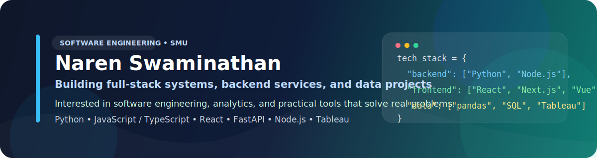

# Naren Swaminathan

<!-- profile-readme-refresh -->

## About Me

I'm a Software Engineering student at Singapore Management University who enjoys building practical systems across software engineering, backend development, and data-focused projects.

Most of my work has been in full-stack applications, backend services, machine learning experiments, and system-style projects where multiple components need to work together cleanly. I'm especially interested in roles where I can keep growing through real engineering problems, strong teams, and hands-on product work.

## Tech I Use

## Selected Projects

### [Fraud Detection Platform](https://github.com/Naren3333/fraud-detection-system)
Microservices-based system focused on fraud scoring, decision flows, notifications, and service-to-service communication. This project helped me grow a lot in backend architecture, reliability, and how data can support decision-making.

### [Stock Market App](https://github.com/Naren3333/signalist_stock-tracker-app-main)
Full-stack stock tracking platform built with Next.js, TypeScript, MongoDB, and event-driven workflows. Includes watchlists, search, charting, and alert-related features.

### [Singapore HDB Price Prediction Model](https://github.com/Naren3333/Price_prediction_model_SG_HDB_flats)
Machine learning and exploratory analysis project using pandas, scikit-learn, Matplotlib, and Seaborn to prepare housing data, engineer features, compare models, and generate reusable visualisations.

### [3D Developer Portfolio](https://github.com/Naren3333/portfolio2)
Interactive portfolio built with React, Tailwind CSS, motion effects, and 3D elements to showcase projects in a more creative and polished way.

## What I'm Exploring

- software engineering internships
- backend and systems-focused projects
- data analytics and visualisation
- machine learning workflows with practical applications

## GitHub Stats

## Contact

